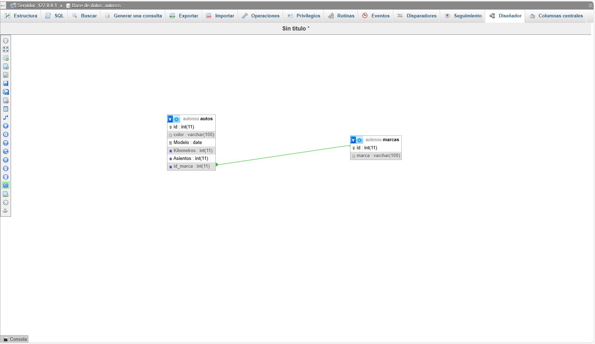

# descripcion
El trabajo consistira en hacer un catalogo de compra para autos, donde el usuario filtrara los autos por sus caracteristicas o por su marca de preferencia, asi este podra elegir la opcion que mas le guste o la mas conveniente
## integrantes 
Agustin Monsalvo - Julian Conti
# diagrama de la base de datos 

## Consideraciones
*Para utilizar la base de datos se debe ir a la carpeta SQL-Entrega2 y descargar el archivo, luego ir a phpMyAdmin crear una base de datos con el nombre autoss ya que asi esta definida el nombre de la base de datos en el archivo config
y luego importar el archivo autoss que se descargo previamente en la base de datos creada.

*Para poder utilizar la pagina se debe tener Apache y MySQL de Xampp encendido y escribir en el buscador de un navegador la siguiente url http://localhost/Catalogo/ Es muy importante que la carpeta Catalogo no este dentro de ninguna otra carpeta ya que las rutas estan pensadas para que Catalogo sea la carpeta principal.

*Para poder loguearse como administrador correctamente en el formulario del usuario debe escribir donde dice "Correo electronico": webadmin donde dice "Contraseña": admin y donde dice "Ingrese su Rol": Administrador, es importante que ingrese la palabra Administrador tal como esta escrita aqui para dejar loguearse correctamente y para cerrar sesion simplemente debe hacer click en el link que dice "Cerrar Sesion". 
